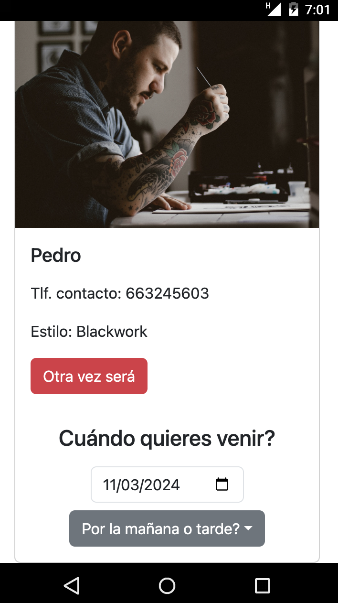

# Front Estudio de tatuajes REACT.JS

<div align="center">
  
  <h1>Héctor's Tattoo Shop</h1>
</div>

<details>
  <summary>Contenido 📝</summary>
  <ol>
    <li><a href="#objetivo">Objetivo</a></li>
    <li><a href="#sobre-el-proyecto">Sobre el proyecto</a></li>
    <li><a href="#stack">Stack</a></li>
    <li><a href="#funcionalidades">Funcionalidades</a></li>
    <li><a href="#instalación-en-local">Instalación</a></li>
    <li><a href="#futuras-funcionalidades">Futuras funcionalidades</a></li>
    <li><a href="#contribuciones">Contribuciones</a></li>
    <li><a href="#licencia">Licencia</a></li>
    <li><a href="#webgrafia">Webgrafia</a></li>
    <li><a href="#desarrollo">Desarrollo</a></li>
    <li><a href="#agradecimientos">Agradecimientos</a></li>
    <li><a href="#contacto">Contacto</a></li>
  </ol>
</details>


## Objetivo

Este proyecto requería un frontal funcional conectado a mi base de dartos a través de la API Rest que hice anteriormente.
Link repositorio del backend: https://github.com/HSoriano99/proyecto4EstudioDeTatuajes

## Sobre el proyecto

Consiste en crear una aplicación web para un estudio de tatuajes, que nos permitirá registrarnos, ver y crear citas para tatuarnos con diferentes tatuadores y realizar diferentes consultas a la base de datos. Disponemos de varias vistas como home donde encontarás un breve resumen acerca del estudio, nuestros artistas donde podras ver informacion acerca de cada uno y siempre que seas un cliente logueado, pedir una cita con el artista, perfil de usuario donde podrás modificar tus datos de perfil, ya seas admin, cliente o artista logueado. Consultar las citas que tienes como cliente o como artista, crear nuevas como cliente o acceder a una nueva vista de gestión del estudio como admin, para ver todos los usuarios con opción de eliminar y todas las citas pudiendo modificarlas o eliminarlas también.

## Stack

Tecnologías utilizadas:

- JAVASCRIPT
- REACT.JS
- REDUX
- REACT BOOTSTRAP
- SQL/MySQL
- EXPRESS
- DOCKER
- NODE.JS
- TYPESCRIPT
- TYPEORM

## Funcionalidades

  <div>
    
    
    
  </div>


<details>
  <summary>Cliente 🙋🏽‍♂️</summary>
  <ol>
    <li>🔐 Registro / Login</li>
    <li>📝 Editar datos de perfil</li>
    <li>👀 Consultar sus citas concertadas con información del artista</li>
    <li>💉📆 Ver los artistas disponibles y crear citas nuevas</li>
  </ol>
  <div >
    
    
    
    
    
  </div>
</details>
<details>
  <summary>Artista 🦹🏼</summary>
  <ol>
    <li>🔐 Login</li>
    <li>📝 Editar datos de perfil</li>
    <li>👀 Consultar sus citas concertadas con información del cliente</li>
  </ol>
  <div >
    
    
  </div>
</details>
<details>
  <summary>Admin 🕵🏻‍♂️</summary>
  <ol>
    <li>🔐 Login</li>
    <li>📝 Editar datos de perfil</li>
    <li>🔎 Consultar todos los usuarios de la aplicación y posibilidad de eliminar usuarios</li>
    <li>🔎📝 Consultar todas las citas de la aplicación y posibilidad de modificarlas o eliminarlas</li>
  </ol>
  <div >
    
    
    
    
    
  </div>
</details>


## Puesta en marcha

1. Clonar el repositorio
2. `$ npm install`
3. Conectamos nuestro repositorio con la base de datos
4. Iniciamos nuestra DB y nuestra API Rest
5. Iniciamos nuestro frontal
6. `$ npm run dev`
7. ...


## Futuras funcionalidades

[ ] Acceder a los diferentes diseños y detalles de cada artista en la vista de Nuestros Artistas
[ ] ...
[ ] ...

## Contribuciones

Las sugerencias y aportaciones son siempre bienvenidas.

Puedes hacerlo de dos maneras:

1. Abriendo una issue
2. Crea un fork del repositorio
   - Crea una nueva rama
     ```
     $ git checkout -b feature/nombreUsuario-mejora
     ```
   - Haz un commit con tus cambios
     ```
     $ git commit -m 'feat: mejora X cosa'
     ```
   - Haz push a la rama
     ```
     $ git push origin feature/nombreUsuario-mejora
     ```
   - Abre una solicitud de Pull Request

## Licencia

Este proyecto se encuentra bajo licencia de "Hector"

## Webgrafia:

Para conseguir mi objetivo he recopilado información de:

- Documentacion propia del curso GeeksHubs junto con las sesiones grabadas.
- Documentacion propia de React.js, React Bootstrap,...
- ...

## Desarrollo:

```js
const developer = "Hector";

console.log("Desarrollado por: " + developer);
```

## Agradecimientos:

Agradezco a mis compañeros el tiempo dedicado a este proyecto:

- **Erika**

- **Gabriel**

- **Reynaldo**

Así como a los profesores de GeeksHubs Academy, concretamente a Demian, por acompañarnos y guiarnos en el proceso en todo momento.

## Contacto

<a href = "hsoriano9986@gmail.com"></a>
